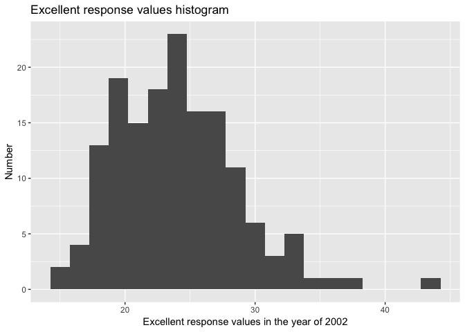
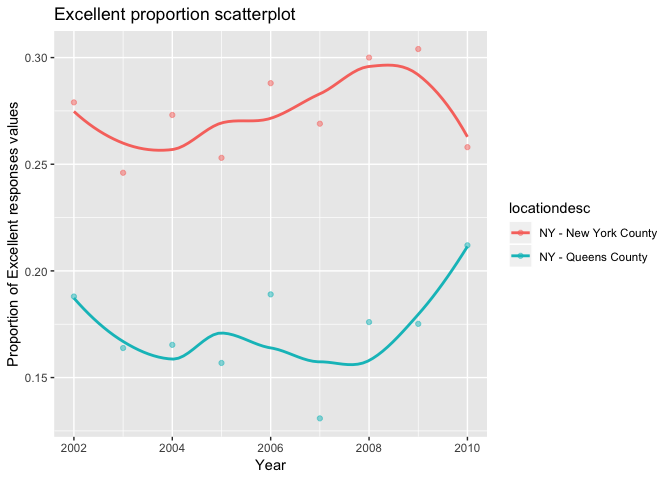

p8015\_hw2\_sy2824
================
Sijia Yue

Problem 1
=========

Data cleaning
-------------

``` r
subway_data = 
  read.csv(file = "./data/NYC_Transit_Subway_Entrance_And_Exit_Data.csv") %>%
  janitor::clean_names() %>%
  select(line:vending, ada) %>%
  select(-exit_only) %>%
  mutate(entry = recode(entry,"YES" = "TRUE", "NO" = "FALSE")) %>%
  mutate(vending = recode(vending, "YES" = "TRUE", "NO" = "FALSE")) 
```

First, I read csv file into R and cleaned the format of variable names. Then, I deleted the unrelating coloums according to the question. Next, I deleted the exit\_only coloum since it is totally related to the coloum "entry". Finally, I changed the "entry" and "vending" coloum from charater to logical.

How many distinct stations?
---------------------------

``` r
distinct(subway_data,line,station_name) %>%
nrow()
```

    ## [1] 465

There are 465 distinct stations.

How many stations are ADA compliant?
------------------------------------

``` r
filter(subway_data,ada == "TRUE") %>%
distinct(line, station_name) %>%  
nrow()
```

    ## [1] 84

There are 84 ADA compliant.

What proportion of station entrances / exits without vending allow entrance?
----------------------------------------------------------------------------

``` r
num_entry_without_vending = nrow(filter(subway_data, entry == "TRUE",vending == "FALSE")) 
proportion = num_entry_without_vending/nrow(filter(subway_data,vending == "FALSE"))
proportion
```

    ## [1] 0.3770492

The proportion of station entrances / exits without vending is 0.38

Reformat data
-------------

``` r
tidy_subway_data =
  gather(subway_data,key = route_number, value = route_served, route1:route11) %>%
  filter(route_served != 'NA') %>% 
  select(-route_number)
```

    ## Warning: attributes are not identical across measure variables;
    ## they will be dropped

How many distinct stations serve the A train?
---------------------------------------------

``` r
filter(tidy_subway_data, route_served == "A") %>%
  distinct(station_name, line) %>%
  nrow()
```

    ## [1] 60

``` r
filter(tidy_subway_data, route_served == "A") %>%
  filter(ada == "TRUE") %>%
  distinct(station_name, line) %>%
  nrow()
```

    ## [1] 17

There are 60 distinct stations serve the A train. 17 of them have ADA complaint.

Problem 2
=========

Data cleaning
-------------

``` r
trash_wheel_data = 
  read_excel("./data/HealthyHarborWaterWheelTotals2017-9-26.xlsx",range = 'A2:N256') %>% 
  janitor::clean_names() %>%
  rename("number" = "dumpster",  "weight" = "weight_tons" , "volume" = "volume_cubic_yards")  %>% 
  #select(-month, -year) %>% 
  filter(number != "NA")  
  
trash_wheel_data$sports_balls = as.integer(trash_wheel_data$sports_balls)
```

``` r
precipitation_2016_data = 
  read_excel("./data/HealthyHarborWaterWheelTotals2017-9-26.xlsx", sheet = "2016 Precipitation", range = 'A2:B15') %>%
  janitor::clean_names() %>% 
  filter(month != "NA") %>% 
  mutate(year = 2016) 
  
precipitation_2017_data = 
  read_excel("./data/HealthyHarborWaterWheelTotals2017-9-26.xlsx", sheet = "2017 Precipitation", range = 'A2:B15') %>%
  janitor::clean_names() %>% 
  filter(month != "NA") %>% 
  mutate(year = 2017) 
    
precipitation_data = 
  bind_rows(precipitation_2016_data, precipitation_2017_data)  %>% 
  mutate(month = month.name[month]) %>% 
  arrange(year, month, total)
```

what was the total precipitation in 2017?
=========================================

``` r
total_2017_data = filter(precipitation_data, year == "2017", total != "NA")
total_2017 = sum(total_2017_data$total)
```

The total precipitation in 2017 is 29.93 tons.

What was the median number of sports balls in a dumpster in 2016?
=================================================================

``` r
filter(trash_wheel_data, year == "2016", sports_balls != "NA")
```

    ## # A tibble: 51 x 14
    ##    number month  year date                weight volume plastic_bottles
    ##     <dbl> <chr> <dbl> <dttm>               <dbl>  <dbl>           <dbl>
    ##  1    116 Janu~  2016 2016-01-10 00:00:00   3.6      15            3240
    ##  2    117 Febr~  2016 2016-02-02 00:00:00   4.06     18            3530
    ##  3    118 Febr~  2016 2016-02-03 00:00:00   2.11     15            2340
    ##  4    119 Febr~  2016 2016-02-05 00:00:00   3.01     15            2460
    ##  5    120 Febr~  2016 2016-02-17 00:00:00   3.41     18            1340
    ##  6    121 Febr~  2016 2016-02-19 00:00:00   3.66     15             950
    ##  7    122 Febr~  2016 2016-02-25 00:00:00   4.51     15            2240
    ##  8    123 March  2016 2016-03-01 00:00:00   2.89     18            3050
    ##  9    124 March  2016 2016-03-11 00:00:00   2.89     15            1630
    ## 10    125 March  2016 2016-03-12 00:00:00   2.51     15            1120
    ## # ... with 41 more rows, and 7 more variables: polystyrene <dbl>,
    ## #   cigarette_butts <dbl>, glass_bottles <dbl>, grocery_bags <dbl>,
    ## #   chip_bags <dbl>, sports_balls <int>, homes_powered <dbl>

``` r
sports_balls_2016_median = median(trash_wheel_data$sports_balls)
```

The median number of sports balls in a dumpster in 2016 is 13.

Problem 3
=========

``` r
tidy_brfss = 
  brfss_smart2010 %>%
  janitor::clean_names() %>% 
  filter(topic == "Overall Health") %>% 
  select(-class, -topic, -question, -sample_size, -(confidence_limit_low:geo_location))

structured_brfss = 
  spread(tidy_brfss, key = response, value = data_value) %>% 
  janitor::clean_names() %>% 
  mutate(proportion = (excellent + very_good)/sum(excellent:very_good))
```

    ## Warning in excellent:very_good: numerical expression has 2125 elements:
    ## only the first used

    ## Warning in excellent:very_good: numerical expression has 2125 elements:
    ## only the first used

How many unique locations are included in the dataset? Is every state represented? What state is observed the most?
-------------------------------------------------------------------------------------------------------------------

``` r
distinct(structured_brfss,locationabbr, locationdesc) %>% 
  nrow()
```

    ## [1] 404

``` r
distinct(structured_brfss, locationabbr) %>% 
  nrow()
```

    ## [1] 51

``` r
count(structured_brfss,locationabbr) %>% 
  arrange(desc(n))
```

    ## # A tibble: 51 x 2
    ##    locationabbr     n
    ##    <chr>        <int>
    ##  1 NJ             146
    ##  2 FL             122
    ##  3 NC             115
    ##  4 WA              97
    ##  5 MD              90
    ##  6 MA              79
    ##  7 TX              71
    ##  8 NY              65
    ##  9 SC              63
    ## 10 CO              59
    ## # ... with 41 more rows

There are 404 unique locations in this dataset, and every state is represented. New Jersey is observed the most.

In 2002, what is the median of the “Excellent” response value?
--------------------------------------------------------------

``` r
structured_brfss_2002 = filter(structured_brfss, year == "2002") 
median(structured_brfss_2002$excellent, na.rm = TRUE)
```

    ## [1] 23.6

The median of the "Excellent" response is 23.6

Make a histogram of “Excellent” response values in the year 2002.
-----------------------------------------------------------------

``` r
ggplot(structured_brfss_2002, aes(x = excellent)) +
  geom_histogram()
```

    ## `stat_bin()` using `bins = 30`. Pick better value with `binwidth`.

    ## Warning: Removed 2 rows containing non-finite values (stat_bin).



Make a scatterplot showing the proportion of “Excellent” response values in New York County and Queens County (both in NY State) in each year from 2002 to 2010.
----------------------------------------------------------------------------------------------------------------------------------------------------------------

``` r
filter(structured_brfss, locationdesc == "NY - New York County" | locationdesc == "NY - Queens County") %>% 
ggplot(aes(x = year, y = excellent)) +
  geom_point(aes(color = locationdesc))
```


